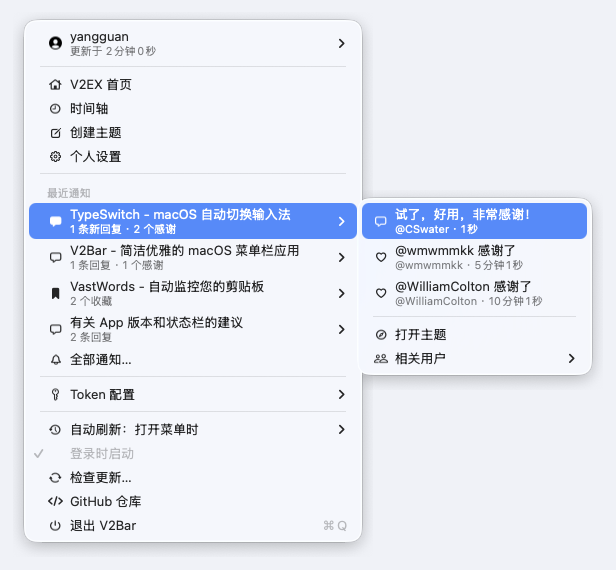
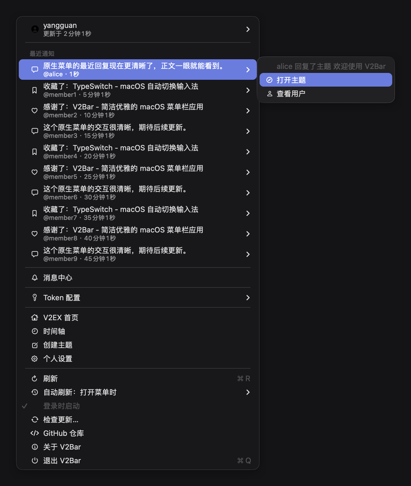

# V2Bar 🌟

<div align="center">
    
    
</div>

<div align="center">

[](https://github.com/ygsgdbd/V2Bar/releases/latest)
[](https://github.com/ygsgdbd/V2Bar)
[](https://tuist.io)
[](https://developer.apple.com/xcode/)
[](https://developer.apple.com/xcode/swiftui/)

</div>

V2Bar 是一个简洁优雅的 macOS 菜单栏应用，为你提供快捷的 V2EX 访问体验。✨

## 预览 👀

<div align="center">
    
    
</div>

## 功能特点 ✨

- 🚀 原生 SwiftUI 开发，超低内存占用
- 🌓 完美支持暗黑模式
- ⚡️ 便捷的菜单栏操作体验
- 👤 快速查看消息和个人信息
- 🔄 支持打开菜单时或定时自动刷新
- 🚀 支持登录时启动与 Sparkle 应用内更新
- 🔗 一键导航到 V2EX 各版块
- ✍️ 便捷创建和浏题
- 🔒 简单可靠的本地数据存储
- 📖 开源透明，安全可审计

## 为什么选择 V2Bar ✨

- 🚀 **轻量高效**: 原生 SwiftUI 开发，内存占用低至 40MB，安装包仅 8MB
- 🔒 **简单可靠**: 本地数据存储，无需担心隐私泄露
- 👀 **开源透明**: 源代码完全开放，欢迎审计

## 系统要求 🖥

- 📱 macOS 14.0 或更高版本
- 💪 完美支持 Apple Silicon 和 Intel 芯片

## 快速开始 🚀

1. 📥 完成安装后首次启动 V2Bar
2. 🔑 登录 V2EX 网站获取 Personal Access Token
3. 🔒 在 V2Bar 中填入 Token 完成授权
4. ✨ 开始享受便捷的 V2EX 浏览体验

> 💡 提示: Personal Access Token 可以在 V2EX 网站的 [设置页面](https://v2ex.com/settings) 生成。请妥善保管你的 Token。

## 安装方式 📥

### 使用 Homebrew 安装 🍺

```bash
# 安装 V2Bar 应用
brew install ygsgdbd/tap/v2bar
```

### 手动安装 📦

1. 🔍 从 [Releases](https://github.com/ygsgdbd/V2Bar/releases) 页面下载最新版本的 DMG 文件
2. 💾 打开 DMG 文件并将 V2Bar 拖入 Applications 文件夹
3. 🚀 从 Applications 文件夹启动 V2Bar

## 开发指南 👨‍💻

本项目使用 [Tuist](https://tuist.io) 进行项目管理，开发前请确保安装以下依赖：

```bash
# 安装 Tuist 项目管理工具
brew install tuist
```

克隆项目并生成 Xcode 工程：

```bash
# 克隆 V2Bar 项目代码
git clone https://github.com/ygsgdbd/V2Bar.git

# 进入项目目录
cd V2Bar

# 使用 Tuist 生成 Xcode 项目文件
tuist generate
```

### 项目结构 

```
V2Bar/
├── Sources/
│   ├── App/          # App 启动与 README demo
│   ├── Clients/      # 网络与系统依赖
│   ├── Features/     # TCA Reducer
│   ├── Models/       # 数据模型
│   ├── Network/      # V2EX 请求实现
│   └── Views/        # 原生菜单视图
```

### 技术栈 🛠

- 🎯 [SwiftUI](https://developer.apple.com/xcode/swiftui/)
- 🧭 [The Composable Architecture](https://github.com/pointfreeco/swift-composable-architecture)
- 🌐 [Alamofire](https://github.com/Alamofire/Alamofire)
- ✨ [Sparkle](https://github.com/sparkle-project/Sparkle)
- 📦 [Tuist](https://tuist.io)

## 问题反馈 💭

如果你发现了 bug 或有新功能建议，欢迎提交 [Issue](https://github.com/ygsgdbd/V2Bar/issues) 进行反馈。我们会认真对待每一条反馈意见！ 🙏

## 开源协议 📄

本项目采用 MIT 开源许可证 - 详见 [LICENSE](LICENSE) 文件 ⚖️
